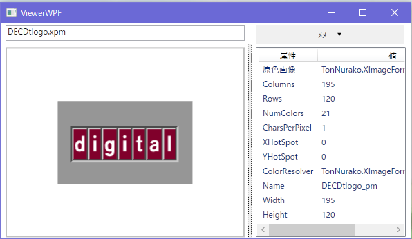

# TonNurako.XImageFormat

X11でよく使うのにWIC/GDI+が読んでくれない画像の読み書きが出来るよ。

[ﾄﾝﾇﾗｺ](https://github.com/sazae657/TonNurako)の実装方針に従い、依存関係解決が面倒くせえｻーﾄﾞﾊﾟーﾃｨーのﾗｲﾌﾞﾗﾘーは一切使用していません。

## 対応ﾌﾟﾗｯﾄﾌｫーﾑ
Windows .NET Framework 4.6.1以降

Unix系(macOS除く) Mono 4.4以降

*CLIが実装されていれば他のﾌﾟﾗｯﾄﾌｫーﾑでも動くかもしれません(macOS除く)*

## 対応ﾌｫーﾏｯﾄ
|   |読み込み|書き出し|
|---|------|-------------|
| XPM | ○ |   ○    |
| XBM | ○ |   ○    |
| PBM (Ascii/Binary) | ○ |   ○    |
| PGM (Ascii/Binary) | ○ |   ○    |
| PPM (Ascii/Binary) | ○ |   ○    |
| PAM (BW) | ○ | ○ |
| PAM (Gray) | ○ | ○ |
| PAM (RGB) | ○ | ○ |
| PAM (BW+Alpha) | ○ | ○ |
| PAM (Gray+Alpha) | ○ | ○ |
| PAM (RGB+Alpha) | ○ | ○ |

## 作業中ﾌｫーﾏｯﾄ
|   | 読み込み   |   書き出し |
|---|------|-------------|
| Sun Raster  | - |  - |
| Silicon Graphics Image  | - |  - |
| XWD | - | (たぶんやらない)  |
| PFM | 仕様が謎いので保留 ||

# Windows専用簡易ﾋﾞｭーｱー

ViewerWPF\XImageViewerWPF.sln をﾋﾞﾙﾄﾞすると動きます

## ﾗｲｾﾝｽ
MIT
